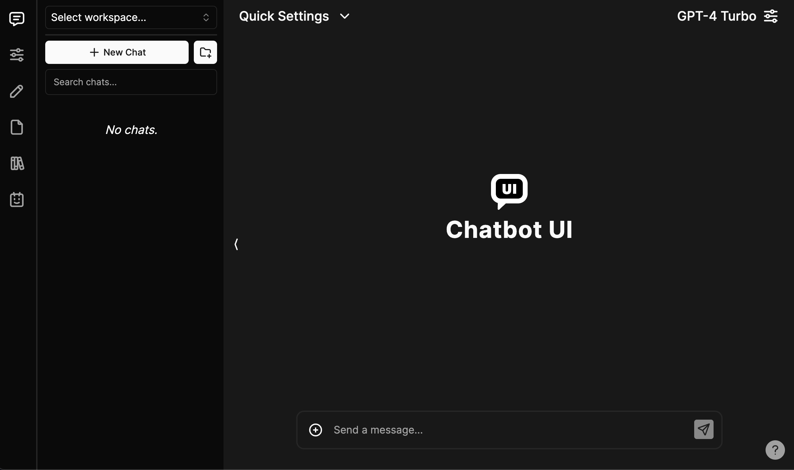

# Chatbot UI

The open-source AI chat app for everyone.



## Demo

View the latest demo [here](https://twitter.com/Shash_shashu).

## Updates

Hey everyone! I've heard your feedback and am working hard on a big update.

Things like simpler deployment, better backend compatibility, and improved mobile layouts are on their way.

Be back soon.

-- Shashank

## Official Hosted Version

Use Chatbot UI without having to host it yourself!

Find the official hosted version of Chatbot UI [here](https://chatbotui.com).

## Issues

We restrict "Issues" to actual issues related to the codebase.

We're getting escessive amounts of issues that amount to things like feature requests, cloud provider issues, etc.

If you are having issues with things like setup, please refer to the "Help" section in the "Discussions" tab above.

Issues unrelated to the codebase will likely be closed immediately.

## Discussions

We highly encourage you to participate in the "Discussions" tab above!

Discussions are a great place to ask questions, share ideas, and get help.

Odds are if you have a question, someone else has the same question.

## Legacy Code

Chatbot UI was recently updated to its 2.0 version.

The code for 1.0 can be found on the `legacy` branch.

## Updating

In your terminal at the root of your local Chatbot UI repository, run:

```bash
npm run update
```

If you run a hosted instance you'll also need to run:

```bash
npm run db-push
```

to apply the latest migrations to your live database.


```bash
git clone https://github.com/shashank8617/chatbot-ui-main.git
```

### 2. Install Dependencies

Open a terminal in the root directory of your local Chatbot UI repository and run:

```bash
npm install
```

### 3. Install Supabase & Run Locally

#### Why Supabase?

Previously, we used local browser storage to store data. However, this was not a good solution for a few reasons:

- Security issues
- Limited storage
- Limits multi-modal use cases

We now use Supabase because it's easy to use, it's open-source, it's Postgres, and it has a free tier for hosted instances.

We will support other providers in the future to give you more options.

#### 1. Install Docker

You will need to install Docker to run Supabase locally. You can download it [here](https://docs.docker.com/get-docker) for free.

#### 2. Install Supabase CLI

**MacOS/Linux**

```bash
brew install supabase/tap/supabase
```

**Windows**

```bash
scoop bucket add supabase https://github.com/supabase/scoop-bucket.git
scoop install supabase
```

#### 3. Start Supabase

In your terminal at the root of your local Chatbot UI repository, run:

```bash
supabase start
```

### 4. Fill in Secrets

#### 1. Environment Variables

In your terminal at the root of your local Chatbot UI repository, run:

```bash
cp .env.local.example .env.local
```

Get the required values by running:

```bash
supabase status
```

Note: Use `API URL` from `supabase status` for `NEXT_PUBLIC_SUPABASE_URL`

Now go to your `.env.local` file and fill in the values.

If the environment variable is set, it will disable the input in the user settings.

#### 2. SQL Setup

In the 1st migration file `supabase/migrations/20240108234540_setup.sql` you will need to replace 2 values with the values you got above:

- `project_url` (line 53): `http://supabase_kong_chatbotui:8000` (default) can remain unchanged if you don't change your `project_id` in the `config.toml` file
- `service_role_key` (line 54): You got this value from running `supabase status`

This prevents issues with storage files not being deleted properly.

### 5. Install Ollama (optional for local models)

Follow the instructions [here](https://github.com/jmorganca/ollama#macos).

### 6. Run app locally

In your terminal at the root of your local Chatbot UI repository, run:

```bash
npm run chat
```

Your local instance of Chatbot UI should now be running at [http://localhost:3000](http://localhost:3000). Be sure to use a compatible node version (i.e. v18).

You can view your backend GUI at [http://localhost:54323/project/default/editor](http://localhost:54323/project/default/editor).

## Hosted Quickstart

Follow these steps to get your own Chatbot UI instance running in the cloud.

Video tutorial coming soon.

### 1. Follow Local Quickstart

Repeat steps 1-4 in "Local Quickstart" above.

You will want separate repositories for your local and hosted instances.

Create a new repository for your hosted instance of Chatbot UI on GitHub and push your code to it.

### 2. Setup Backend with Supabase

#### 1. Create a new project

Go to [Supabase](https://supabase.com/) and create a new project.

#### 2. Get Project Values

Once you are in the project dashboard, click on the "Project Settings" icon tab on the far bottom left.

Here you will get the values for the following environment variables:

- `Project Ref`: Found in "General settings" as "Reference ID"

- `Project ID`: Found in the URL of your project dashboard (Ex: https://supabase.com/dashboard/project/<YOUR_PROJECT_ID>/settings/general)

While still in "Settings" click on the "API" text tab on the left.

Here you will get the values for the following environment variables:

- `Project URL`: Found in "API Settings" as "Project URL"

- `Anon key`: Found in "Project API keys" as "anon public"

- `Service role key`: Found in "Project API keys" as "service_role" (Reminder: Treat this like a password!)

#### 3. Configure Auth

Next, click on the "Authentication" icon tab on the far left.

In the text tabs, click on "Providers" and make sure "Email" is enabled.

We recommend turning off "Confirm email" for your own personal instance.

#### 4. Connect to Hosted DB

Open up your repository for your hosted instance of Chatbot UI.

In the 1st migration file `supabase/migrations/20240108234540_setup.sql` you will need to replace 2 values with the values you got above:

- `project_url` (line 53): Use the `Project URL` value from above
- `service_role_key` (line 54): Use the `Service role key` value from above

Now, open a terminal in the root directory of your local Chatbot UI repository. We will execute a few commands here.

Login to Supabase by running:

```bash
supabase login
```

Next, link your project by running the following command with the "Project ID" you got above:

```bash
supabase link --project-ref <project-id>
```

Your project should now be linked.

Finally, push your database to Supabase by running:

```bash
supabase db push
```

Your hosted database should now be set up!

### 3. Setup Frontend with Vercel

Go to [Vercel](https://vercel.com/) and create a new project.

In the setup page, import your GitHub repository for your hosted instance of Chatbot UI. Within the project Settings, in the "Build & Development Settings" section, switch Framework Preset to "Next.js".

In environment variables, add the following from the values you got above:

- `NEXT_PUBLIC_SUPABASE_URL`
- `NEXT_PUBLIC_SUPABASE_ANON_KEY`
- `SUPABASE_SERVICE_ROLE_KEY`
- `NEXT_PUBLIC_OLLAMA_URL` (only needed when using local Ollama models; default: `http://localhost:11434`)

You can also add API keys as environment variables.

- `OPENAI_API_KEY`
- `AZURE_OPENAI_API_KEY`
- `AZURE_OPENAI_ENDPOINT`
- `AZURE_GPT_45_VISION_NAME`

For the full list of environment variables, refer to the '.env.local.example' file. If the environment variables are set for API keys, it will disable the input in the user settings.

Click "Deploy" and wait for your frontend to deploy.

Once deployed, you should be able to use your hosted instance of Chatbot UI via the URL Vercel gives you.

## Contact

Message Shashank on [LinkedIn](https://www.linkedin.com/in/shashank-k-7042002s)
# Completed Chatbot UI
chatbot UI


<b>Let's Connect Over: [LinkedIn](https://www.linkedin.com/in/shashank-k-7042002s) & [Twitter](https://twitter.com/Shashank8617)</b>


</a>
  <a href="https://www.linkedin.com/in/shashank-karigowda">
  &nbsp;
</a>
<a href="https://twitter.com/Shashank8617">
  
</a>
  


<h1 align="center">Hey Everyone 👋, I'm Shashank</h1>
<div align="center">  </div>
<h3 align="center">A passionate DevOps Engineer  


<p align="left">  </p>

- 🔭 I’m currently seeking opportunity

-  **Cloud Devops AWS Azure**

- 👨‍💻 All of my projects are available at [https://github.com/shashank8617](https://github.com/shashank8617)

- 💬 Ask me about **Cloud Devops AWS Azure**

- 📫 How to reach me **shashank.karigowda@gmail.com**


<h3 align="left">Connect with me:</h3>
<p align="left">
<a href="https://www.linkedin.com/in/shashank-karigowda" target="blank"></a>
<a href="https://instagram.com/shashank_karigowda" target="blank"></a>

  
</p>

<h3 align="left">Languages and Tools:</h3>
<p align="left"> <a href="https://aws.amazon.com" target="_blank" rel="noreferrer">  </a> <a href="https://azure.microsoft.com/en-in/" target="_blank" rel="noreferrer">  </a> <a href="https://circleci.com" target="_blank" rel="noreferrer">  </a> <a href="https://www.w3schools.com/css/" target="_blank" rel="noreferrer">  </a> <a href="https://www.docker.com/" target="_blank" rel="noreferrer">  </a>  <a href="https://www.gatsbyjs.com/" target="_blank" rel="noreferrer">  </a> <a href="https://git-scm.com/" target="_blank" rel="noreferrer">  </a> <a href="https://grafana.com" target="_blank" rel="noreferrer">  </a> <a href="https://www.w3.org/html/" target="_blank" rel="noreferrer">  </a> <a href="https://www.java.com" target="_blank" rel="noreferrer">  </a> <a href="https://www.jenkins.io" target="_blank" rel="noreferrer">  </a> <a href="https://kubernetes.io" target="_blank" rel="noreferrer">  </a> <a href="https://www.linux.org/" target="_blank" rel="noreferrer">  </a> <a href="https://www.mysql.com/" target="_blank" rel="noreferrer">  </a> <a href="https://www.nginx.com" target="_blank" rel="noreferrer">  </a> <a href="https://www.photoshop.com/en" target="_blank" rel="noreferrer">  </a> <a href="https://postman.com" target="_blank" rel="noreferrer">  </a> <a href="https://www.selenium.dev" target="_blank" rel="noreferrer">  </a> <a href="https://spring.io/" target="_blank" rel="noreferrer">  </a>  </p>

<p></p>

<p>&nbsp;</p>

<p></p>

### 🔝 Top Contributed Repo


